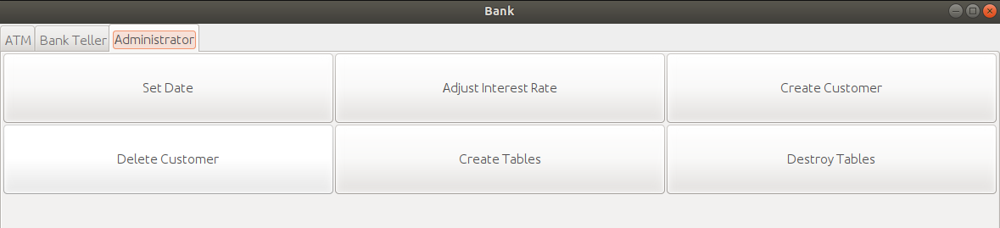

# Bank Database

- **Description**

A mock-up banking system class project. Through the use of ER-Diagrams all the Integrity Constraints required for the banking database to function as intended were outlined for best performance.The system allows for the following operations:

* Checking Account Creation / Deletion.
* Create a Customer.
* Make deposits / withdrawals.
* Transfers to friend accounts.	
* Display Balance and monthly statements.
* Accrue interest at the end of the month for particular accounts.
* List closed accounts.
* Table Creation /Deletion.	
* Generate DTER reports for suspicious account balances/transactions.

The project includes a GUI to perform the afforementioned actions. There is a Customer Interface that allows a user to sign in and perform actions on his account such as transfers, deposits and withdrawals when the desired action is selected:

There is a Bank Teller Interface for Bank Operators to be able to perform higher privilege actions such as account creation and deletion, viewing statements, accrue interest on accounts etc...

Lastly there is an Administrator Interface which allows for system maintanence operations such as adjusting date, dropping and creating tables:

___
- **Relevant Area** : Databases, Graphical Interfaces.
___
- **Tools / Platforms**: Java, Java Swing graphics, Oracle SQL, Unix. 
___
**Installation**
1. Clone repository.
2. Update the database information in App.java (**DB_URL**, **DB_USER**,**DB_PASSWORD**) to connect to a valid Oracle SQL instance.
3. Using the provided Makefile, type: `make gui` to compile the necessary Java bytecode and run the program.
4. Once the GUI loads up, using the Administrator Interface create the tables in the database.
5. In the Bank Teller Interface populate the database with valid user which will be unique and each posses a pin to log into their account.
6. Either as Bank teller or Customer Interface (after log in) perform any of the desired actions.
7. Enjoy!

